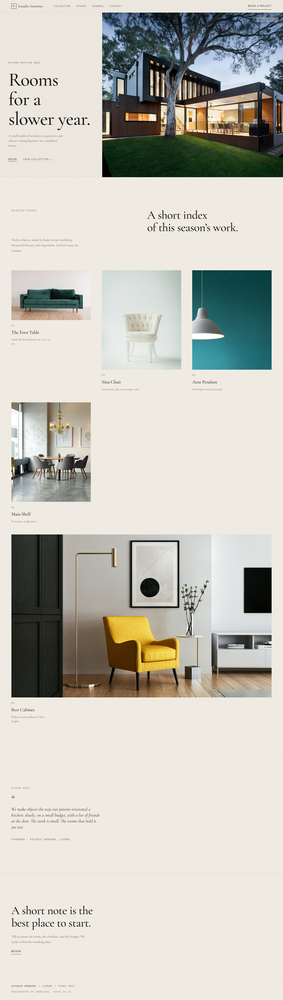

# Estudio Anonimo · Autumn 2026

> A small studio of architects, carpenters, and editors making furniture for considered homes.

A high-end furniture campaign homepage. Editorial-magazine layout, warm bone palette,
restrained motion, and typography that breathes.



## About

This is the **Autumn Edition 2026** hero/landing page for *Estudio Anonimo*, a fictional
small studio. The design language takes cues from real high-end furniture brands
(ESTUDIO ANONIMO, Vincent Van Duysen, Studio Sofield, Apparatus) and the editorial
photography of Apartamento / AnOther Magazine.

The full design rationale, three design alternatives, and a 50-point pre-flight check
live in the source task report — see `prompts/prompts.md` for the AI image prompts
used to generate the supporting visuals, and the `outbox/` history of the original
task for the complete design process.

## Design at a glance

| Dial | Value | Notes |
|------|-------|-------|
| Aesthetic | Editorial-magazine | Single hairline seam, asymmetric grid, restrained motion |
| Palette | Bone + oxblood + ink | Warm neutrals, one accent only |
| Typography | Cormorant Garamond (display) + Inter Tight (micro) + JetBrains Mono (meta) | No Inter as page voice |
| Motion | 3 / 10 | One hero fade, one seam-draw, one CTA hover. No GSAP, no scroll listeners |
| Density | 2 / 10 | Gallery-airy. 80–160px section padding |
| Variance | 7 / 10 | 1/3 + 2/3 split hero, 6-column asymmetric grid below |

## Project structure

```
estudio-anonimo/
├── index.html              ← single page (CSS inlined, no build step)
├── images/                 ← 7 editorial photographs (Unsplash, see credits below)
│   ├── hero-interior.jpg
│   ├── forn-table.jpg
│   ├── sina-chair.jpg
│   ├── aroz-pendant.jpg
│   ├── maia-shelf.jpg
│   ├── bres-cabinet.jpg
│   └── wood-detail.jpg
├── prompts/
│   ├── prompts.md          ← 7 English + Chinese AI image prompts (MJ/DALL-E/可灵)
│   └── fetch-images.py     ← Unsplash downloader used to source the photos
├── preview.png             ← Full-page screenshot
├── LICENSE                 ← MIT
└── README.md
```

## How to run

This is a static site. No build step, no dependencies, no server required.

```bash
# Option 1: open directly
open index.html        # macOS
start index.html       # Windows
xdg-open index.html    # Linux

# Option 2: serve locally (recommended for fonts to load cleanly)
python -m http.server 8000
# then visit http://localhost:8000
```

The page makes exactly **one** external request: Google Fonts
(`Cormorant Garamond`, `Inter Tight`, `JetBrains Mono`). All other assets are local.

## Browser support

Tested on the latest two versions of Chrome, Edge, Firefox, and Safari.
Uses `min-height: 100dvh` for hero — gracefully falls back to `100vh` on older browsers
via CSS cascade. CSS Grid is required (IE11 not supported).

## Replacing the photographs

The seven photographs are placeholders from Unsplash. For a production build, swap
each one with an editorial photograph matching the brief in `prompts/prompts.md`:

1. **Hero interior** (4:5, 1600×2000) — quiet interior, daylight on stone
2. **The Forn Table** (4:5, 1200×1500) — solid oak table
3. **Sina Chair** (4:5, 900×1100) — steam-bent ash, paper cord
4. **Aroz Pendant** (4:5, 900×1100) — hand-spun brass
5. **Maia Shelf** (4:5, 900×1100) — travertine
6. **Bres Cabinet** (16:10, 1400×800) — walnut
7. **Wood detail** (1:1, 800×800) — hand-planed oak

To regenerate with AI, copy the prompts from `prompts/prompts.md` into Midjourney
v6, DALL-E 3, or Kling, and overwrite the same filenames in `images/`.

## Credits

- **Design system, HTML, CSS:** built with the help of Lio's `taste-skill`
  (Sections 0–5 + Section 14 Pre-Flight Check).
- **Photography:** [Unsplash](https://unsplash.com) — free editorial use.
- **Typefaces:** [Cormorant Garamond](https://fonts.google.com/specimen/Cormorant+Garamond),
  [Inter Tight](https://rsms.me/inter/),
  [JetBrains Mono](https://www.jetbrains.com/lp/mono/) — all Open Font License.

## License

MIT — see `LICENSE`.
